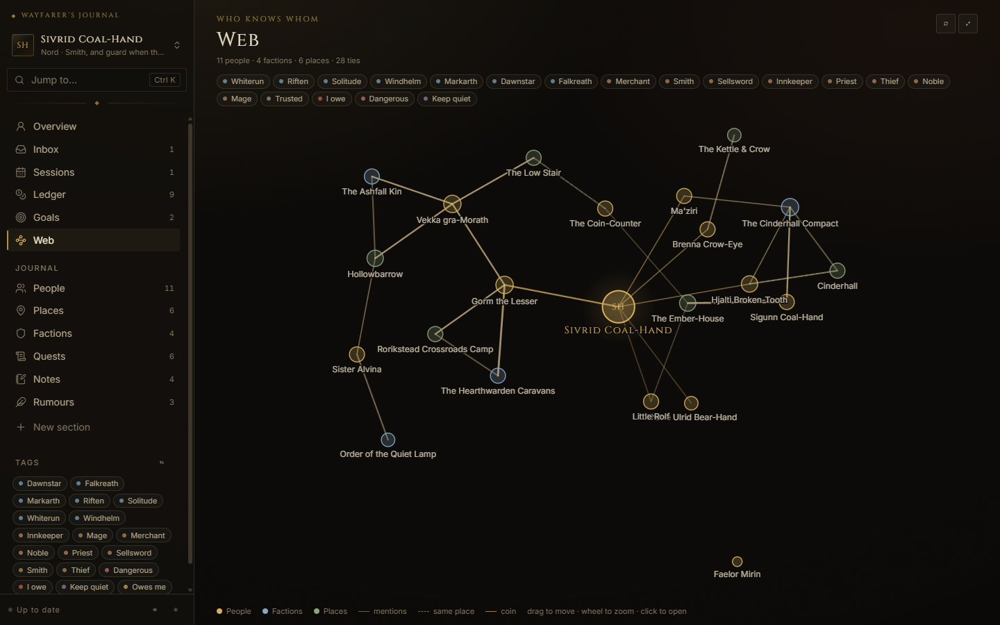
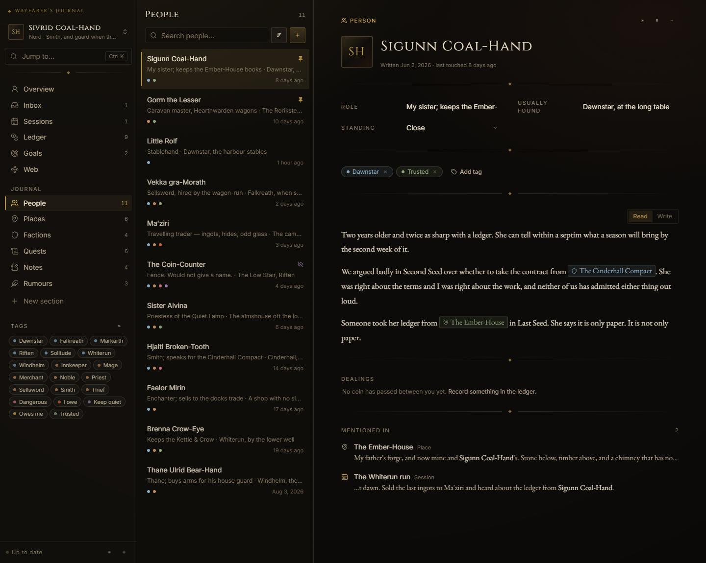
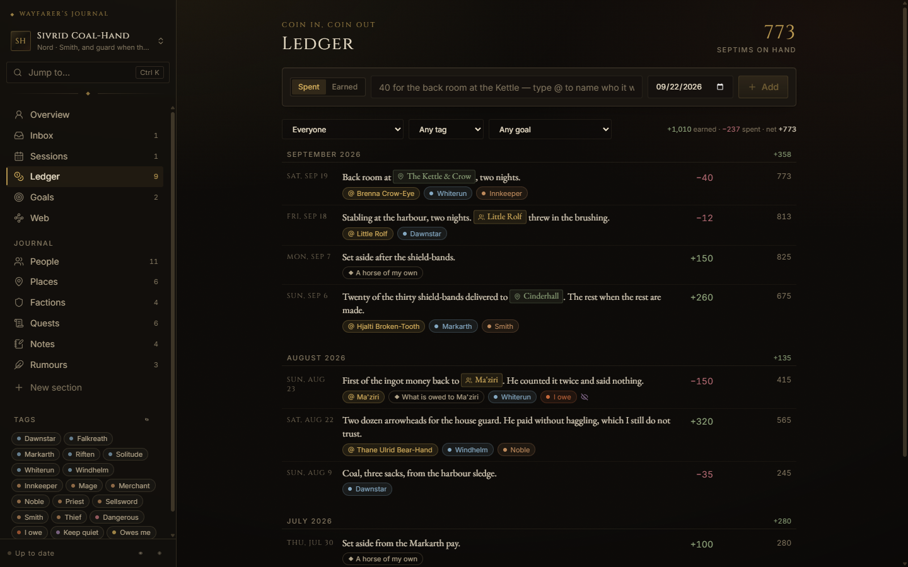
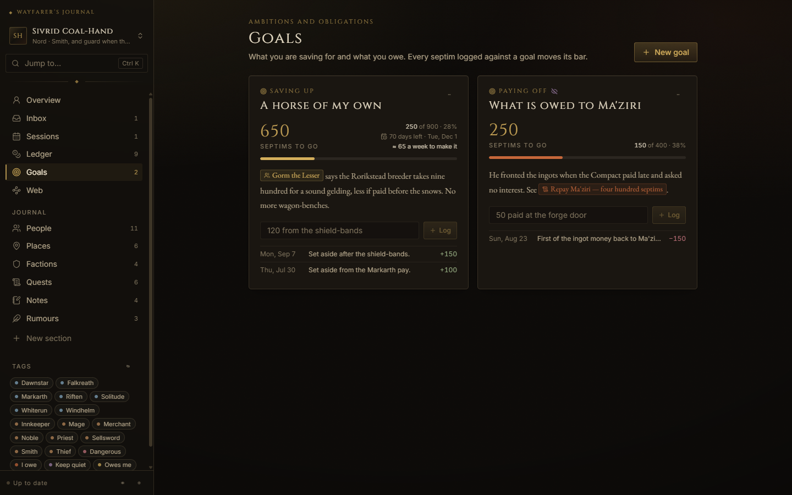
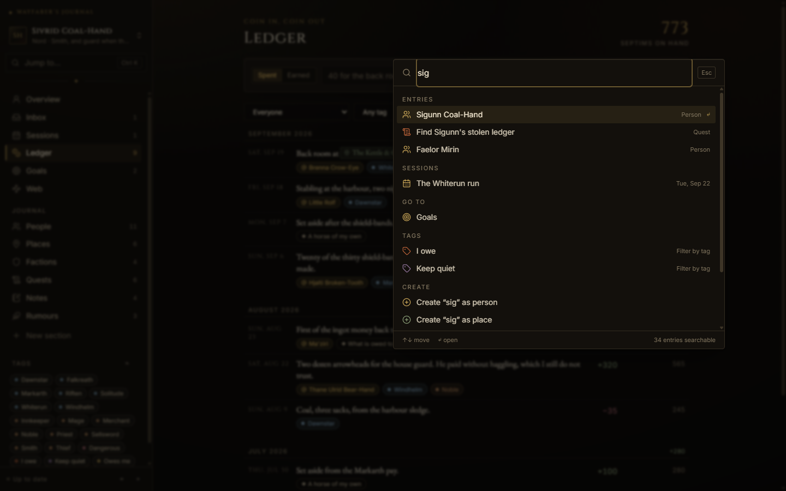
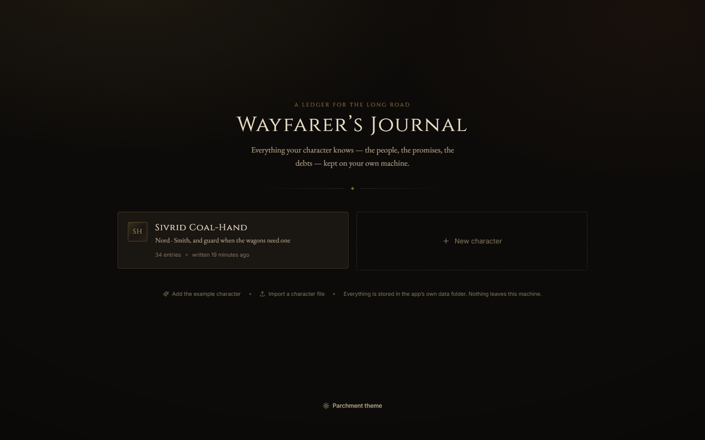

# Wayfarer's Journal

**A journal for your roleplay characters.** Who they met, what they promised, what they owe and to whom, and what happened last night — kept on your own PC, in files you own.

[](https://buymeacoffee.com/yuriyzdev)
[](https://github.com/YZvirblis/Wayfarer-s-Journal/releases/latest)
[](LICENSE)



It was born on **Keizaal Online**, a roleplay server where one character can carry years of promises and grudges, but nothing in it is tied to one game. If you play a character somewhere and keep a pile of notes about them, this is for that pile.

---

## Contents

- [Features](#features)
- [Download](#download)
- [Run from source](#run-from-source)
- [Usage guide](#usage-guide)
- [Keyboard shortcuts](#keyboard-shortcuts)
- [Where your data lives](#where-your-data-lives)
- [Privacy](#privacy)
- [FAQ](#faq)
- [Contributing](#contributing)
- [Support](#support)
- [Licence and disclaimer](#licence-and-disclaimer)

---

## Features

| | |
| --- | --- |
|  | **Entries that link to each other.** People, Places, Factions, Quests, Notes, and any section you invent. Write `[[Name]]` anywhere and the entries know about each other — every entry lists where it is mentioned, with the sentence it was mentioned in. |
|  | **A ledger.** Every coin that came in or went out, with a running balance, who it involved, and what it was for. Type `+40 @Gorm the Lesser for the horse` and it is filed. Every person shows their dealings with you. |
|  | **Goals.** Saving for a house or paying off a debt. Progress comes from the ledger, so it is always right; the card tells you what is left, how many days remain, and what that means per week. |
|  | **One box for everything.** `Ctrl+K` finds any entry, section, tag or profile section, creates entries, switches characters, and reaches every command in the app. |
|  | **One journal per character.** Each character is a separate file with its own sections, tags, ledger, goals and portrait. Duplicate one to start an alt, or load the fictional example to look around. |

And besides those:

- **Relationship web** — a force-directed map of the people, factions and places around your character, built from your links, shared locations and ledger dealings. Hover to see the ties, click to open, drag to arrange, zoom to explore.
- **Quick capture, even over the game** — press `Ctrl+/` inside the journal, or `Ctrl+Shift+J` anywhere on your PC with the desktop app, jot a line, press Enter. It lands in the Inbox to be filed later as an entry, added to one you already have, or dismissed.
- **Session log** — a dated timeline of play sessions. Link the people and places involved and they will list the session under "Mentioned in".
- **Custom sections and fields** — add *Rumours*, *Contracts*, *Recipes*, whatever your character keeps track of, with its own icon and colour, and give any section the fields it needs: text, a choice from a list, or a number.
- **Tags** — colour-coded, optionally grouped, created as you type, filtered from the sidebar.
- **Hide secrets** — flag in-character secrets and, when you stream or screenshot, blur them all with one toggle. Click to peek at one; nothing secret shows in the web, backlinks or the palette while it is on.
- **Portraits** — paste, drop or pick an image for your character and for the people they know.
- **Markdown** — plain text that reads well: lists, tables, emphasis, quotes, all rendered as you leave the field.
- **Export and import** — a full JSON export you can re-import on another PC, and a readable Markdown export of the whole journal.
- **Backups you can actually use** — the last twenty saves of every character are kept and can be restored from inside the app.
- **Two themes** — a dark, firelit one and a warm Parchment one.
- **Autosave** — there are no Save buttons.
- **Works beside a game window** — the layout adapts down to about 600 px wide.

---

## Download

**Windows:** the [latest release](https://github.com/YZvirblis/Wayfarer-s-Journal/releases/latest) has two downloads. There is no installer and nothing to uninstall either way: the app makes a `data` folder next to itself and that is the whole footprint.

- `Wayfarers-Journal-<version>-portable.exe` — one file. Put it in a folder of its own and run it. It unpacks itself into a temporary folder on every launch, which takes a while (about twenty seconds on a fast SSD); you see the splash screen while it does.
- `Wayfarers-Journal-<version>-win-x64.zip` — the same app, already unpacked. Extract the folder anywhere, run `Wayfarer's Journal.exe` inside it, and it starts in a couple of seconds. **Recommended** if you open the journal often.

> **Windows SmartScreen will warn you the first time.** Click **More info → Run anyway**. The warning appears because the executable is not code-signed: a signing certificate costs a few hundred dollars a year, and this is a free, open-source project built by one person. The build is produced in public by [GitHub Actions](.github/workflows/release.yml) straight from the tagged source, so you can read exactly what went into it.

**macOS and Linux:** there is no packaged build yet. [Run from source](#run-from-source) instead; everything except the global hotkey and the tray works the same way in a browser.

---

## Run from source

You need [Node.js](https://nodejs.org/en/download) 20 or newer.

**Windows, the easy way:** download the repository (green **Code** button → **Download ZIP**), unzip it, and double-click `start.bat`. The first run installs and builds, which takes a minute or two; after that it starts in a few seconds and opens your browser at `http://127.0.0.1:4777`. Keep the black window open while you write, or use `stop.bat` to close it.

**macOS / Linux:**

```bash
chmod +x start.sh
./start.sh
```

**By hand, or for development:**

```bash
npm install
npm run dev            # API on 127.0.0.1:4777, Vite dev client on 127.0.0.1:4778
npm run build          # build the client into dist/client
npm start              # serve the API and the built client on 127.0.0.1:4777
npm run typecheck      # strict TypeScript for client, server and Electron
npm run electron:dev   # build everything and open the desktop app
npm run electron:build # build the portable Windows .exe into release/
```

Environment variables the server understands:

| Variable | Meaning |
| --- | --- |
| `WJ_PORT` | port to listen on (default `4777`; the desktop app picks a free one) |
| `WJ_DATA_DIR` | where to keep `data/` (default: the project folder, or next to the .exe) |
| `WJ_OPEN=1` | open the browser once the server is up |

---

## Usage guide

### Characters

The first screen lists your characters. Create one, duplicate one to start an alt, or **load the example** — Sivrid Coal-Hand, an entirely fictional smith with a full journal — to see what a lived-in journal looks like. Delete is two clicks, and a backup is kept.

Inside a journal, the character's name at the top of the sidebar is a menu: switch characters, export, import, restore from a backup, or go back to the list.

### The Overview

The character's profile page: portrait, name, the profile fields (race, age, trade and so on — rename them, add your own, drag to reorder), and long-form sections such as the backstory. The **currency** setting lives here too. It defaults to *septims*; change it to *gold*, *crowns* or whatever your world uses, and the ledger and goals follow.

Your goals appear on the Overview as cards, so the first thing you see is what your character is working towards.

### Entries

Every section (People, Places, Factions, Quests, Notes and your own) is a list on the left and a writing pane on the right. Each entry has a title, tags, the section's fields, a Markdown body, and can be **pinned** to the top or marked **secret**.

- **Quests** have a status (active, on hold, done, failed) and an optional counter with a progress bar: `3 / 10 hides delivered`.
- **People** have a *standing* field (friend, rival, and so on) that also colours their edge in the web, and a *Dealings* panel listing every ledger line they were part of.
- The list has a search box and a tag filter, and can be sorted by last edited, by name or by date created; pinned entries stay on top. Use the arrow keys to move through it and Enter to open.
- Search inside a section shows "N more in other sections"; click it to search the whole journal in the palette.

### Links and backlinks

Type `[[` in any body, capture or session and start writing a name; the autocomplete lists matching entries. `[[Gorm the Lesser]]` becomes a link when rendered. If two entries share a name, `[[Gorm|People]]` picks the section. A link to something that does not exist yet is shown as such; click it to create the entry on the spot. Rename an entry and every link to it is rewritten.

Every entry ends with **Mentioned in**: the entries, captures and sessions that link to it, with the sentence around the link.

### Sections and fields

The sidebar's section menu (or the palette) lets you add a section with its own name, icon and colour, rename it, move it up or down, or delete it. **Edit fields…** on any section opens the field editor: add text, choice or number fields, reorder them, rename them, or remove them. Removing a field that has data asks first and tells you how many entries are affected.

### Tags

Tags are created inline: type in the tag box on any entry and press Enter. The **tag manager** (sidebar menu) sets colours, renames, and groups tags (a group such as *Region* or *Role* becomes a heading in the filter). The sidebar's tag filter narrows every list at once.

### Ledger

The Ledger page is your character's purse. The **quick line** at the top takes the amount first, then what it was for; type `@` to name who it was with:

```
+40 for the horse @Gorm the Lesser
-12 a room at the inn
```

The in/out switch beside the line sets the direction, and a leading `+` or `-` overrides it. Every line can be edited inline to add a note (links work), tags, a person, or the goal it counts toward. The list is grouped by month with totals, filters by person, tag or goal, and shows the running balance on every line and *on hand* at the top.

### Goals

A goal is either **saving up** for something or **paying off** a debt, with a target and an optional deadline. Progress is computed from the ledger lines assigned to it; nothing to keep in sync. Each card has a quick line for a payment or a sum set aside, and shows what is left, the percentage, the days remaining and the per-week amount needed.

### Relationship web

The Web page draws your character in the middle with the people, factions and places around them. Ties come from `[[links]]`, from shared locations, and from ledger dealings. Nodes are coloured by section and sized by how connected they are; edges to people carry their standing. Hover a node to highlight its ties, click to open the entry, drag to rearrange, scroll to zoom, and use the tag filter to focus. **Fit to view** brings everything back on screen; **Shake** lets the layout settle again.

### Sessions

The Sessions page is a dated timeline. Add a session, write what happened (links work), and mark it secret if it should hide with the rest. Entries linked from a session list it under *Mentioned in*, so a person's page becomes a history of every scene they were in.

### Captures and the Inbox

Something happened mid-scene and you have no time to file it: press `Ctrl+/` (inside the journal) or `Ctrl+Shift+J` (anywhere, with the desktop app), type, press Enter. It goes into the **Inbox**, whose count shows in the sidebar. Later, each capture can become a new entry of any type (the first line becomes the title), be appended to an existing entry, or be dismissed.

### Hide secrets

Toggle **Hide secrets** in the sidebar, the icon rail or the palette before you stream or take a screenshot. Every secret entry, session, profile section, goal and ledger line is blurred; click one to peek. Secrets are also left out of the web, backlinks, the palette and the entry pickers while it is on. Captures are never blurred, and balances stay visible. The setting is remembered.

### Portraits

Click the portrait frame on the Overview or on a person to paste an image from the clipboard, drop a file, or pick one. Images are cropped to a square and scaled down to 256 px before they are stored inside the character file.

### Export, import and backups

From the character menu or the palette:

- **Export JSON** writes the whole character file. Import it on another PC as a new character; the app validates and migrates it, previews what it found, and never overwrites anything.
- **Export Markdown** writes a readable document of the whole journal. While *Hide secrets* is on, secrets are left out, and the dialog tells you so.
- **Restore from backup** lists the last twenty saves with timestamps and counts; restore one as a new character or replace the current one (the current one is backed up first).

### Preferences and the desktop app

**Preferences** (the gear in the sidebar, or the palette) shows where your data folder is. In the desktop app it also lets you change the global capture hotkey, shows whether it registered (and why not, if it did not), and controls **Keep running in the tray**: with it on, closing the window hides the journal to the tray so the hotkey keeps working while you play. The tray menu has *Open*, *Quick capture* and *Quit*.

---

## Keyboard shortcuts

| Keys | Where | What |
| --- | --- | --- |
| `Ctrl+K` | anywhere in the journal | Command palette: search, jump, create, switch, commands |
| `Ctrl+/` | anywhere in the journal | Quick capture |
| `Ctrl+Shift+J` | anywhere on your PC (desktop app; configurable) | Quick capture over any window |
| `Enter` | quick capture | Keep and close |
| `Ctrl+Enter` | quick capture | Keep and write another |
| `Shift+Enter` | quick capture | New line |
| `Esc` | dialogs, palette, capture window | Close |
| `↑` `↓` `Home` `End` | entry and session lists, palette, pickers | Move the selection |
| `Enter` | entry list | Open the selected entry with the cursor in its title |
| `↓` | list search box | Walk into the list |
| `[[` | any text field | Link autocomplete (`↑` `↓` to choose, `Enter` or `Tab` to insert) |
| `@` | ledger quick line | Person autocomplete |
| `↑` `↓` on a grip | profile fields, sections, sidebar | Reorder without dragging |

On a Mac, read `⌘` for `Ctrl`.

---

## Where your data lives

```
data/
  settings.json            theme, hide-secrets, last opened character, desktop settings
  characters/<id>.json     one file per character — this is your journal
  backups/<id>/*.json      the last 20 saves of each character, kept automatically
```

- **Desktop app:** `data/` sits next to the `.exe`. Move the folder and the exe together and everything comes with them. If that location cannot be written (say, the exe is inside *Program Files* or on a read-only drive), the app falls back to `%APPDATA%\wayfarers-journal\data` and tells you once; Preferences always shows the folder in use.
- **From source:** `data/` sits in the project folder.

**To back up your journal, copy the `data` folder.** To move to another PC, copy it across. Or use *Export JSON* per character and import it on the other side.

Saves are atomic: a new file is written beside the old one and swapped in, so a crash mid-write cannot leave you with half a journal. The file format is versioned (`schemaVersion`) and older files are migrated on load, with a backup taken first.

---

## Privacy

- Your journal never leaves your machine. The server binds to `127.0.0.1` only and is unreachable from your network, let alone the internet.
- There is no account, no telemetry, no analytics, no update check, and no external script. The About dialog's links open your browser; nothing is fetched behind your back.
- **The desktop app listens for one key combination, and nothing else.** So that the capture hotkey works while a game has the keyboard, the app installs a low-level keyboard hook (the same mechanism AutoHotkey uses). The hook compares each key press against the single combination you configured and discards it. It keeps no buffer and no log, never sees what you type as text, does not watch the mouse, and is removed when the app quits. You can read the whole of it in [`electron/hotkey.ts`](electron/hotkey.ts). If the hook cannot load, the app falls back to a plain Windows hotkey registration, and Preferences tells you which of the two is in use.
- Portraits are stored inside the character file, not uploaded anywhere.
- The bundled example character is fictional and written for this project. Please keep real players' characters, secrets and private conversations out of anything you share publicly.

---

## FAQ

**Windows says "Windows protected your PC".**
Click **More info**, then **Run anyway**. The build is unsigned because a code-signing certificate is a recurring cost that does not make sense for a free tool; see [Download](#download). If you would rather not trust a binary, [run from source](#run-from-source).

**Windows says "An Application Control policy has blocked this file" and the portable exe never opens.**
That is **Smart App Control** (Windows 11), which is stricter than SmartScreen: it refuses unsigned self-extracting launchers outright, with no "Run anyway". Use the **zip** download instead; the unpacked app inside it starts normally. (Turning Smart App Control off is a one-way switch in Windows Security, so the zip is the better answer.)

**"Port 4777 is already in use".**
Something else on your PC is listening there, or a previous journal is still running (`stop.bat` closes it). Otherwise start with another port: `set WJ_PORT=4800` then `npm start` (or `WJ_PORT=4800 npm start` on macOS/Linux). The desktop app never has this problem; it picks a free port each time.

**The app says the data folder is not writable.**
The desktop app tried to create `data/` next to the exe and could not, usually because the exe is in a protected folder such as *Program Files* or on a read-only drive. It has fallen back to `%APPDATA%\wayfarers-journal\data` and your journal is safe there. To keep it beside the exe instead, move the exe to a normal folder (your Documents, a games folder, a USB stick) and copy the `data` folder over.

**The global hotkey does not work.**
Open Preferences and press **Test your hotkey**: the app listens for a few seconds and tells you whether the press arrived. If it did not, another program is probably holding the same combination; pick another one in the same box, in Electron's notation: `CommandOrControl+Shift+J`, `Alt+Shift+F9`, `Control+F12`. Preferences also shows *how* the app is listening. "Through a low-level keyboard hook" is the normal case and works over games that read the keyboard directly. "Registered with Windows" means the hook could not load and the app fell back to a plain hotkey, which games that use DirectInput swallow.

**The hotkey works, but the capture box appears behind the game, or the game keeps the keyboard.**
That is exclusive full-screen mode: the game owns the screen and nothing can be drawn over it. Switch the game to *borderless windowed* (most games offer it under display settings); the box then opens on top and, when you press Enter or Escape, the keyboard goes straight back to the game.

**Is it tied to one game?**
No. Sections, fields, tags and the currency name are all yours to set. The example character is the only place a particular game shows through.

**Does it work on a Mac or on Linux?**
From source, yes, in your browser. The packaged desktop app (global hotkey, tray) is Windows-only for now.

**Where did the "Save" button go?**
There is none. Every change is written to disk moments after you make it; the indicator in the sidebar footer shows when.

**Can two people share a journal?**
Not live. The files are yours; you can export a character and send the JSON to a friend, who imports it as a new character.

---

## Contributing

Issues and pull requests are welcome. Read [CONTRIBUTING.md](CONTRIBUTING.md) for the development setup, the session-docs convention this repository uses, and what a good PR looks like. The design document, roadmap and progress log live in [`docs/`](docs/).

---

## Support

Wayfarer's Journal is free and will stay free. If it earned a place beside your game window, you can buy the author a coffee:

[](https://buymeacoffee.com/yuriyzdev)

---

## Licence and disclaimer

MIT — see [`LICENSE`](LICENSE). Made by Yuriy Zvirblis.

Unofficial fan tool, not affiliated with Bethesda or the Keizaal Online team. The app contains no game assets, logos or trademarked imagery; the artwork, icon and wording are original to this project.
